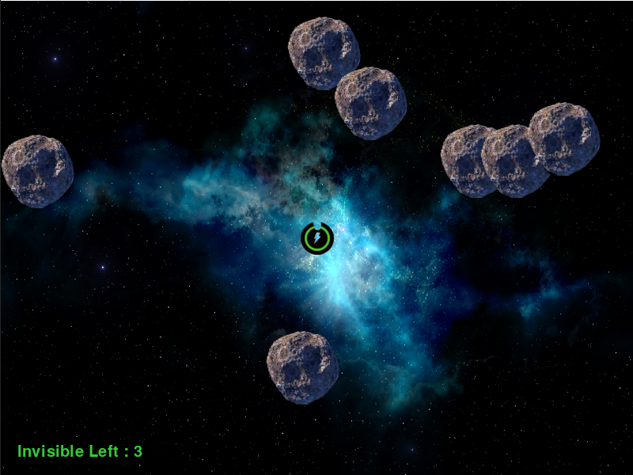

# Space-Asteroid-Game🎮🕹🚀🛸
A good looking but basic space game created using pygame.

Press ```left``` arrow for left direction.\
Press ```Right``` arrow for right direction.\
Press ```Up``` arrow for upward direction.\
Press ```Down``` arrow for downword direction.\
Press ```Space``` for shooting the space-rock.\
Press ```i``` for go throw space-rock without being out.\
Press ```p``` for pause.



